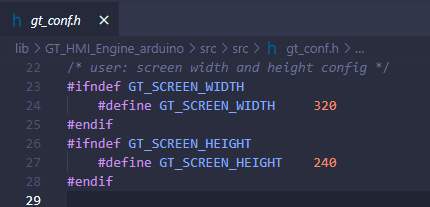
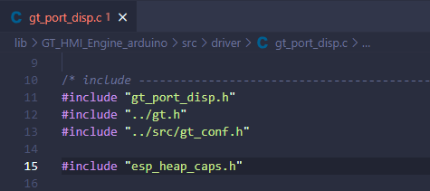
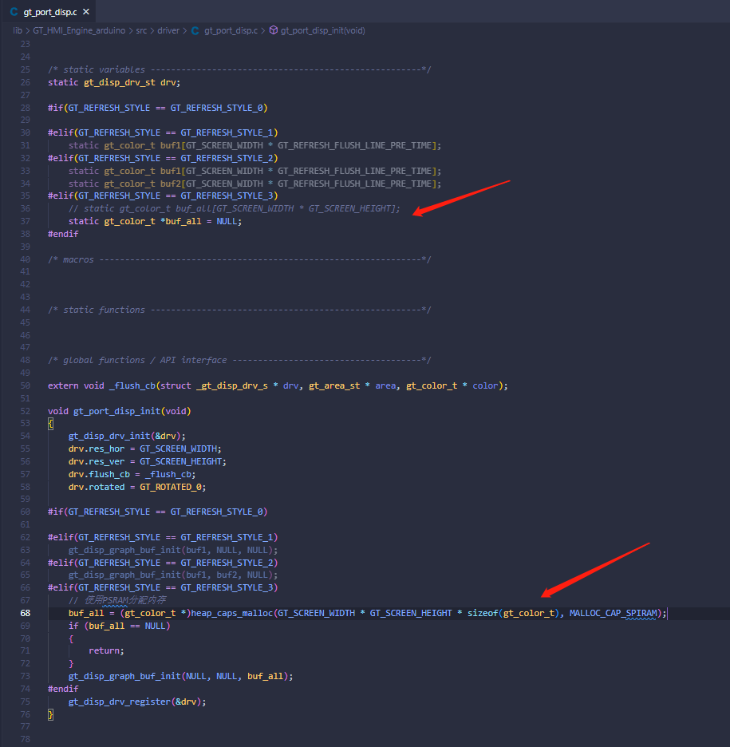
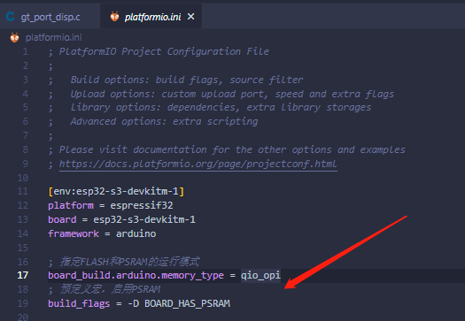
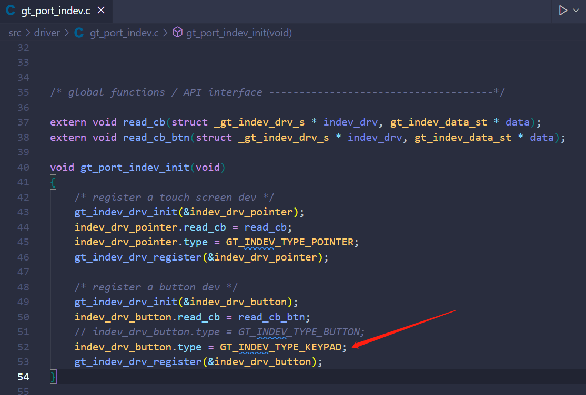
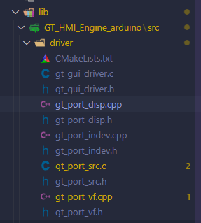
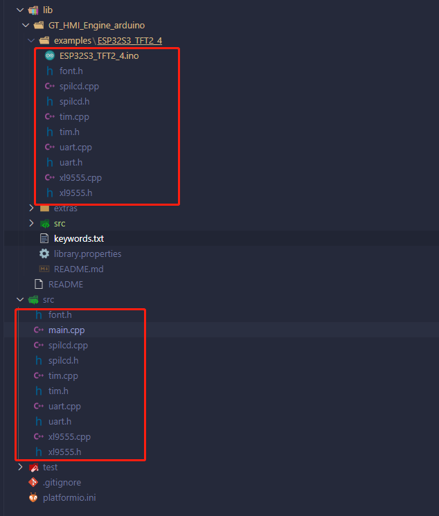
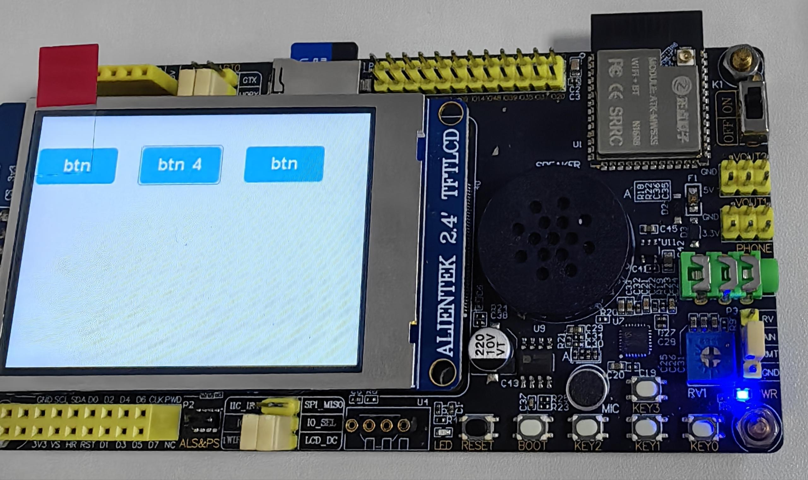

 

    

 

  <a><b>GT-HMI-Engine arduino 库</b></a>

  <a><b>致力于低代码开发，多功能，易用的免费嵌入式图形库</b></a>

---

 

    <a href="https://www.hmi.gaotongfont.cn/kfgj"> 公司官网 </a> |
    <a href="https://space.bilibili.com/3493293474188211/video"> B 站教程 </a> |
    <a href="https://www.hmi.gaotongfont.cn/kfgj#/#hmiEngine"> Engine 使用手册 </a> |
    <a href="https://www.hmi.gaotongfont.cn/kfgj#/#hmidesigner"> Designer 使用手册 </a> |
    <a href="http://isite.baidu.com/site/wjz7qkrv/406a2b0c-f9c7-4a08-a47a-662e862b2af4?ch=48&wid=498ccd5c05334f21a2142ba3cf628964_0_0&field=&orderBy=&categoryId=undefined&title=%E8%81%94%E7%B3%BB%E6%88%91%E4%BB%AC"> 联系方式 </a> |
    <a href="https://genitop-1317577547.cos.ap-nanjing.myqcloud.com/GT-HMI/GT-HMI-Groups/GT-HMI%20Communication%20groups.jpg"> GT HMI微信交流群 </a>

 

#### 介绍
&nbsp;&nbsp;&nbsp;&nbsp;&nbsp;&nbsp;&nbsp;&nbsp;该库采用GT-HMI-Engine(v1.3.x)，用做arduino库，库添加可以通过.zip库导入或者直接把整个文件夹放到库路径下。

**GT-HMI-Engine arduino库目录结构**
<table>
<tr>
  <th style="width:40%">目录</th>
  <th style="width:60%">说明</th>
</tr>
<tr>
  <td>examples/</td>
  <td>存放库的示例程序</td>
</tr>
<tr>
  <td>extras/</td>
  <td>一些辅助性的文件，不是库的核心组成部分</td>
</tr>
<tr>
  <td>src/</td>
  <td>库的核心部分，GT-HMI-Engine源码文件</td>
</tr>
<tr>
  <td>keywords.txt</td>
  <td>关键字文件</td>
</tr>
<tr>
  <td>library.properties</td>
  <td>库特性说明文件</td>
</tr>
</table>

#### 示例
&nbsp;&nbsp;&nbsp;&nbsp;&nbsp;&nbsp;&nbsp;&nbsp;在examples目录下有一个简单的示例ESP32S3_TFT2_4.INO，展示了如何使用GT-HMI-Engine实现控件的显示以及控件事件的触发。

**1. 开发环境**：
   - IDE：VSCode + PlatformIO / Arduino IDE

**2. 硬件**：
   - 主控设备：ESP32S3开发板;
   - 显示设备：2.4寸TFTLCD ST7789V 320*240 (无触摸);
   - 输入设备：物理按键3个，按键PREV和NEXT用于切换控件焦点，按键ENTER用于确认焦点，相当触摸的点击作用，触发事件实现界面的交互。

**3.修改以下文件配置**：

- **gt_conf.h**

把GT_SCREEN_WIDTH改成320，GT_SCREEN_HEIGHT改成240。

- **gt_port_disp.c**

首先，把头文件"esp_heap_caps.h"添加进来，

然后，把buff_all数组使用PSRAM进行内存分配。

最后，还需要修改platformio.ini文件，在这里指定FLASH和PSRAM的运行模式以及启动PSRAM。

- **gt_port_indev.c**

该示例使用了3个物理按键，需要在gt_port_indev_init()里，把注册输入设备按键的类型改成GT_INDEV_TYPE_KEYPAD。

- **gt_port_disp.c，gt_port_indev.c，gt_port_vf.c**

把这几个.c文件都改成.cpp文件，如下图所示：

- **应用工程ESP32S3_TFT2_4.INO**

把examples/ESP32S3_TFT2_4/ESP32S3_TFT2_4.INO里的内容复制到src/main.cpp，然后把对应驱动文件也放在main.cpp所在的路径下，如下图所示：

编译无报错，下载到开发板，示例效果如下所示：

